# Lab 01 — Home Network Setup (Packet Tracer)

## Description
This lab shows how to create a simple home network in Cisco Packet Tracer.  
The network uses wired and wireless connections with basic security.

---

## Part 1: Device Connections

This screenshot shows the home network setup in Cisco Packet Tracer.

- Coaxial cable connects Internet and TV services  
- Cable Splitter separates Internet and TV signals  
- Cable Modem is connected to the Home Wireless Router  
- Two PCs are connected with Ethernet cables  
- The router provides Internet access to all devices  

**Result:**  
All wired devices are connected, and the network has Internet access.

  <a href="screenshots/Screenshot1.png">
    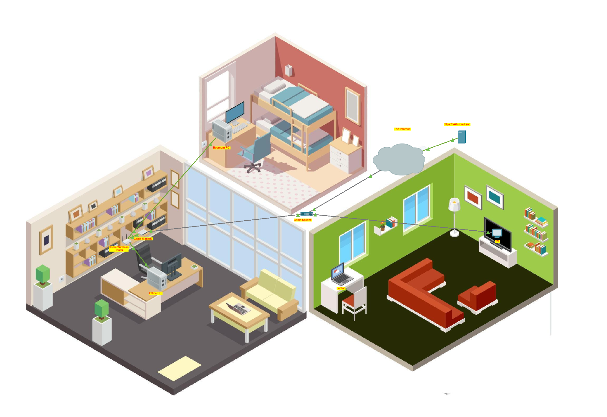
  </a>

---

## Part 2: Setup Home Wireless Router

Most home wireless routers use a GUI (Graphical User Interface) in a web browser.  
In this part, you access the router from the Office PC and set up the home network.

---

### Step 1: Access the Router GUI

On **Office PC** → `Desktop` → `IP Configuration`, click **DHCP**.

  

The PC gets an IP address from the router automatically (IP starts with `192`).

Write down the **Default Gateway** (this is the router’s IP).

Open **Web Browser**, enter the router IP, and log in:

- **Username:** admin  
- **Password:** admin  

  <a href="screenshots/Screenshot3.png">
    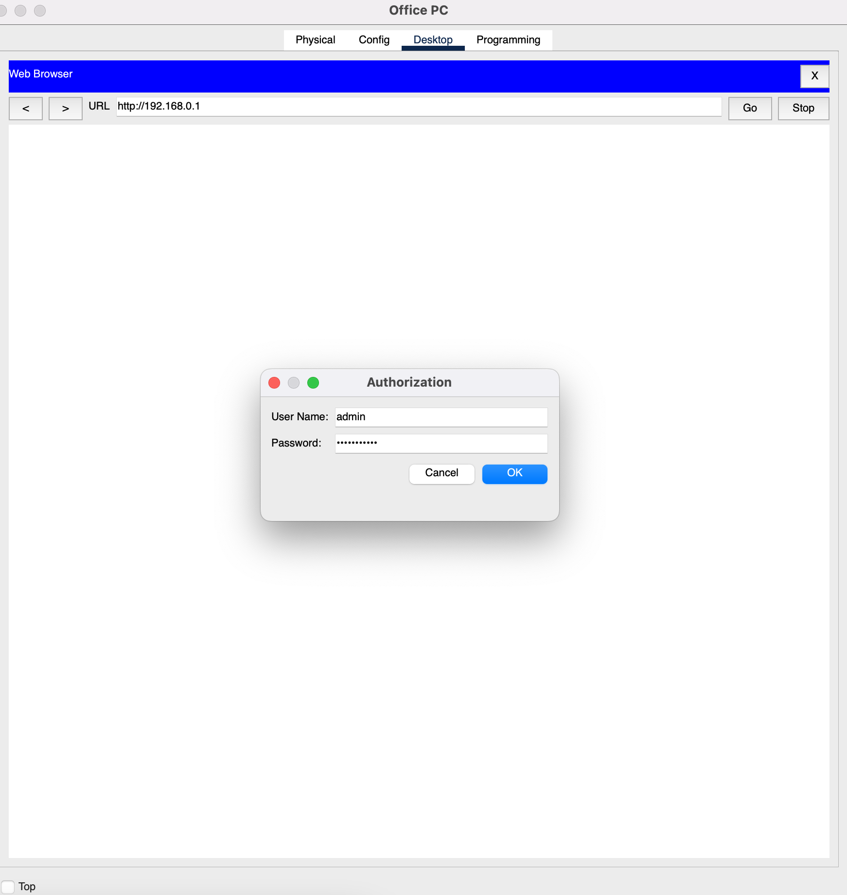
  </a>

> ⚠️ Default passwords should be changed on real devices.

---

### Step 2: Set Basic Settings

Go to `Setup` → `Network Setup` → **Maximum Number of Users**, and set it to **10**.

  <a href="screenshots/Screenshot4.png">
    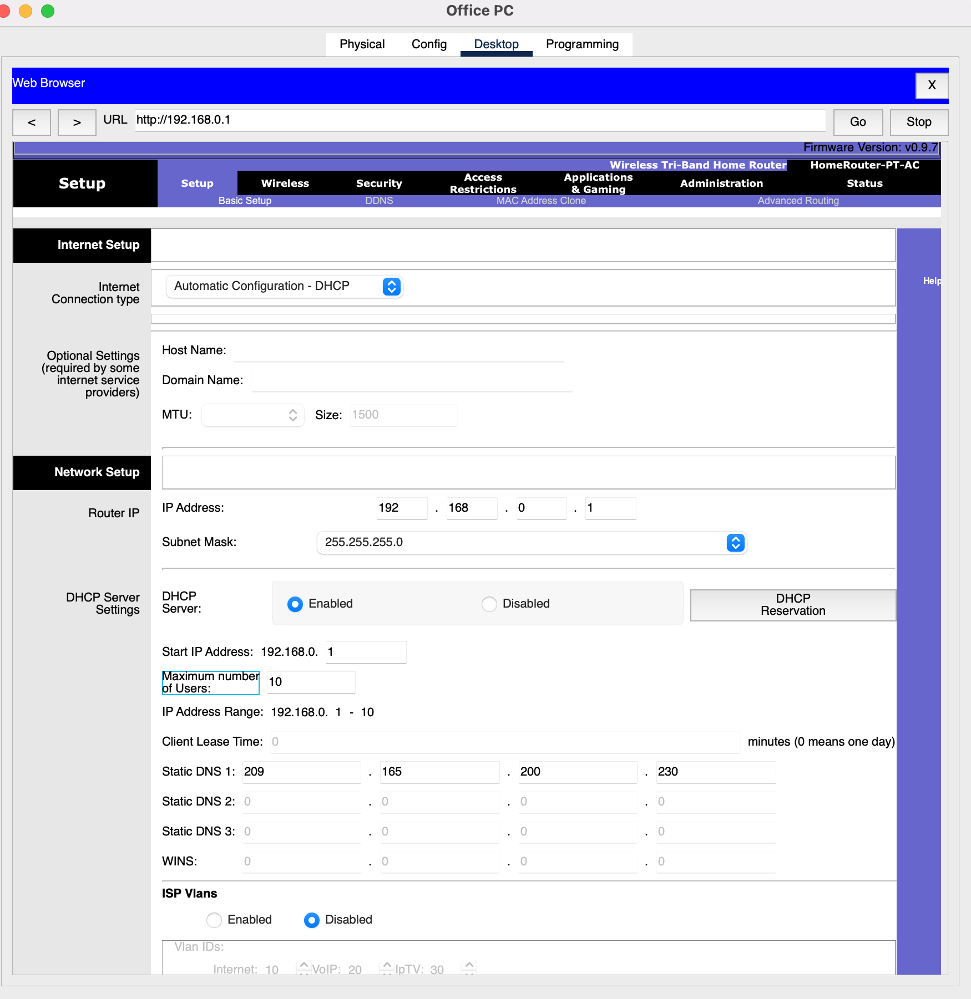
  </a>

Save the settings.

Go to **Administration** and change the password to **MyPassword1!**.  
Log in again with the new password.

  <a href="screenshots/Screenshot5.png">
    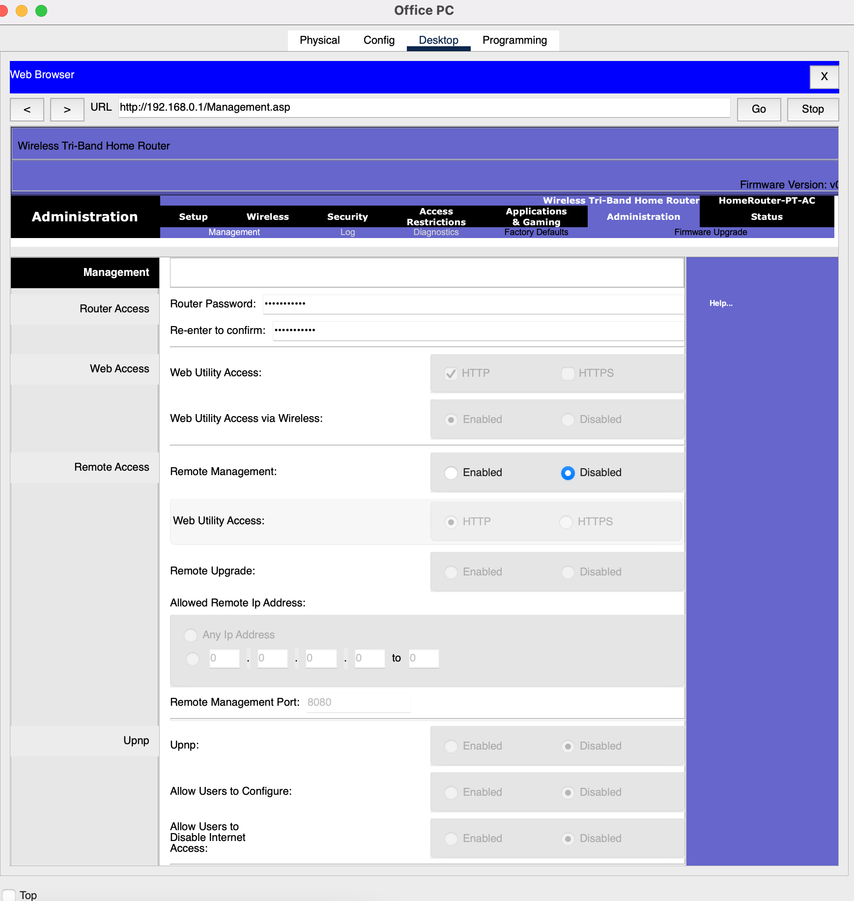
  </a>

  

  <a href="screenshots/Screenshot12.png">
    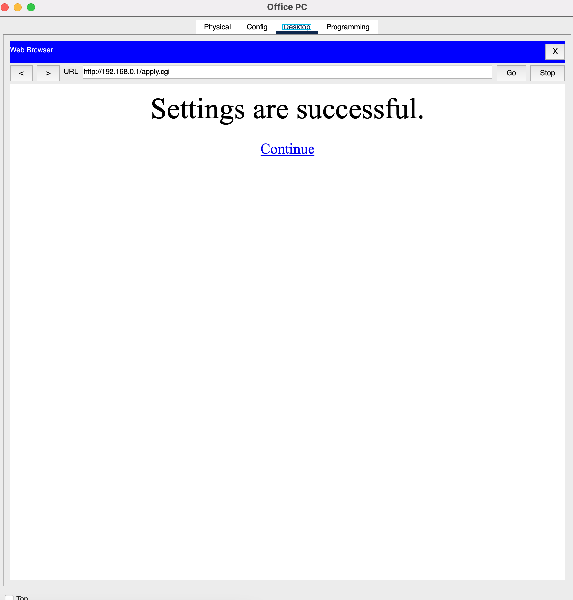
  </a>

---

### Step 3: Set Wireless Network

Go to **Wireless** → enable **2.4 GHz**.  
Change **SSID** to **MyHome**.

  

Go to **Wireless Security** → **WPA2 Personal**.  
Set **Passphrase** to **MyPassPhrase1!**.

  

Save the settings and close the browser.

---

## Part 3: Set IP and Test Connection

Now the router is ready. In this part, IP addresses are assigned and Internet connectivity is tested.

---

### Step 1: Connect Laptop to Wi-Fi

On **Laptop** → `Desktop` → `PC Wireless` → `Connect`.  
Find the **MyHome** network.

  <a href="screenshots/Screenshot9.png">
    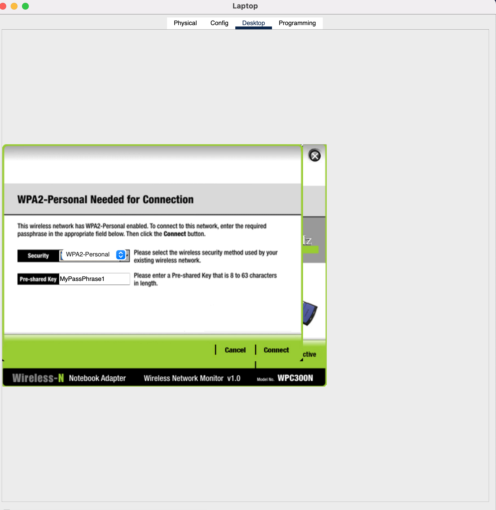
  </a>

Enter the **Pre-shared Key:** `MyPassPhrase1!`, then click **Connect**.  
Check **Link Information** — you should see:  
> “You have successfully connected to the access point.”

  <a href="screenshots/Screenshot10.png">
    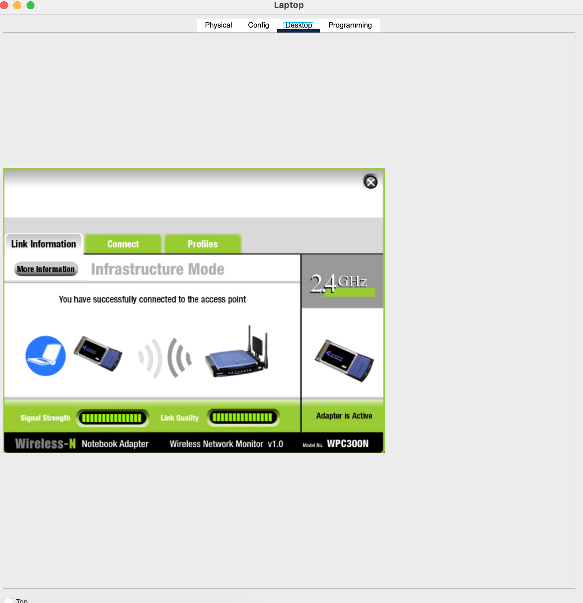
  </a>

Open **Web Browser** and go to `skillsforall.srv` to test Internet access.

  <a href="screenshots/Screenshot11.png">
    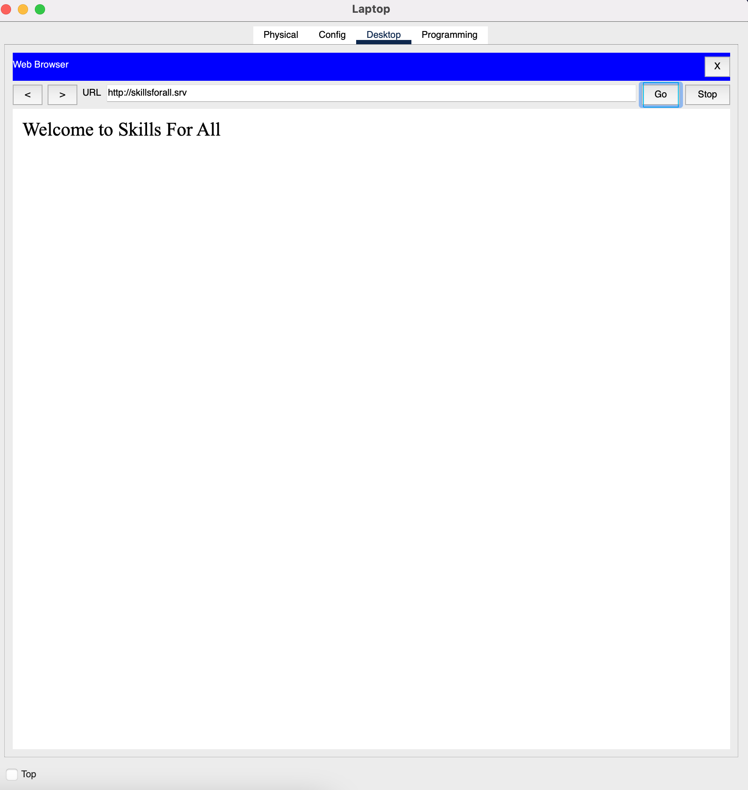
  </a>

> 💡 If the IP address does not start with `192`, click **Fast Forward Time**.

---

### Step 2: Test Office PC

On **Office PC** → `Desktop` → `Web Browser`.  
Go to `skillsforall.srv`.

  <a href="screenshots/Screenshot13.png">
    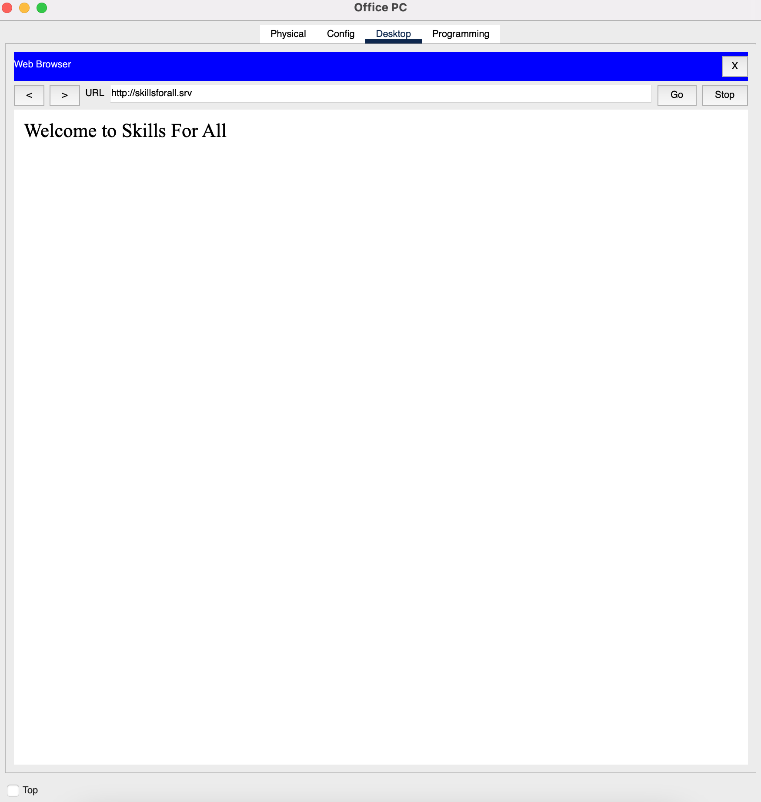
  </a>

This confirms that the Office PC is connected to the Internet.

---

### Step 3: Setup Bedroom PC

On **Bedroom PC** → `IP Configuration`, select **DHCP**.  
Open **Web Browser** and go to `skillsforall.srv`.

  <a href="screenshots/Screenshot14.png">
    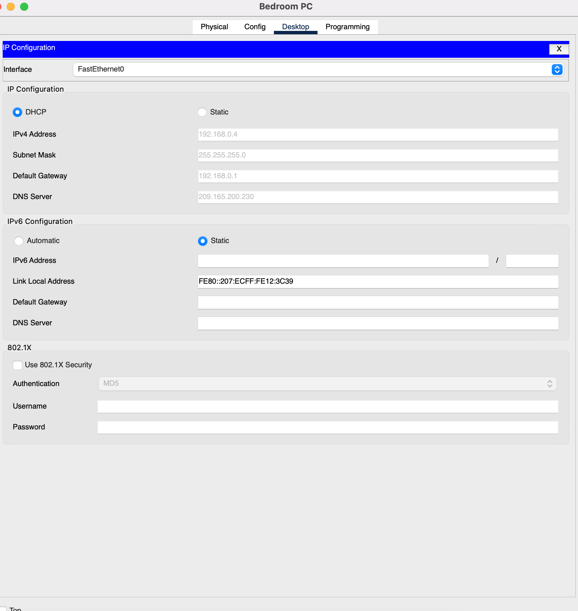
  </a>

  <a href="screenshots/Screenshot15.png">
    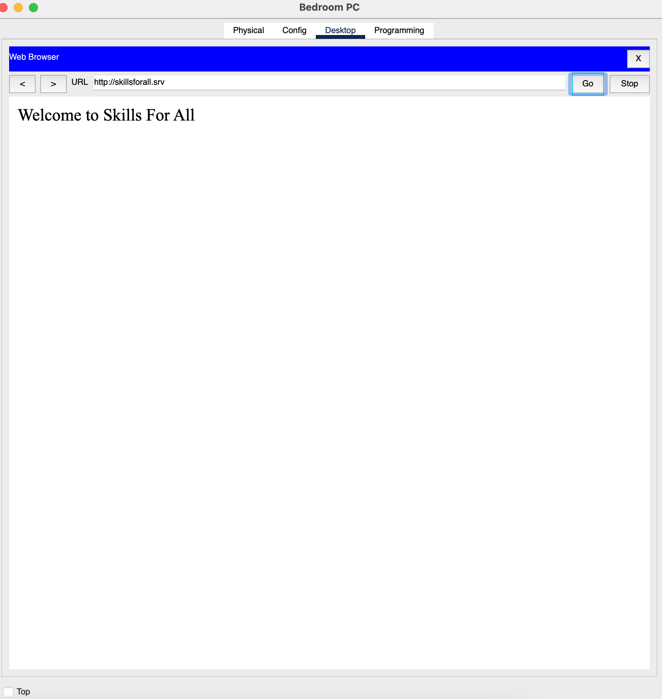
  </a>

---

## ✅ Lab Complete

All devices now have Internet access.  
**Lab complete!** 🎉  

Your friend **Natsumi** thanks you with lunch 🍱🙂
